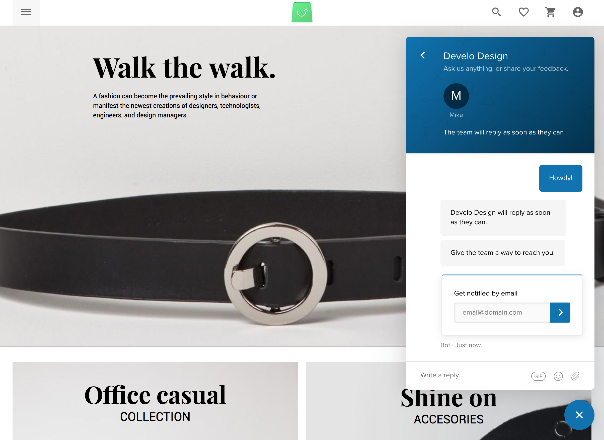

# Vue Storefront Intercom module
[Intercom](https://www.intercom.com) integration for [vue-storefront](https://github.com/DivanteLtd/vue-storefront), by [Develo Design](https://www.develodesign.co.uk).
<br />Intercom account required (free tier is available)
<br /><br />
Intergration with the Intercom customer messaging platform for your Vue Storefront, this Intercom module is configured to update Intercom with the customers current route, this allows you to accurately help your customer, knowing what page they are asking questions on from inside Intercom.
<br /><br />


## Installation:

### 1. Clone the repository

Clone the vsf-intercom repository into your VSF installation.
```shell
$ git clone git@github.com:develodesign/vsf-intercom.git ./vue-storefront/src/modules/intercom
```

### 2. Add the module config to your local VSF configuration file.
Add the following JSON config snippet into your desired config, eg. `config/local.json`
```json
"intercom": {
  "app_id": false
}
```
Replace the `app_id` parameter with the App ID provided by Intercom. You can find your Intercom App ID here: https://www.intercom.com/help/faqs-and-troubleshooting/getting-set-up/where-can-i-find-my-workspace-id-app-id. Setting `app_id` to `false` will disable the intercom module at runtime.
<br />
Valid app_id example: `"app_id": "e8y21262"`

### 3. Register the Intercom module
Open up your `../vue-storefront/src/modules/index.ts` and add the following code. Adding it inside this file the registers the module so it can be used in your Vue Storefront.
<br />
```js
import { Intercom } from './intercom'
...
export const registerModules: VueStorefrontModule[] = [
...
Intercom
...
]
```
### 3. Enjoy!
Thats it! It's easy, plug and play! If you havn't got an Intercom account already, you can create one here, there is free tier that you can use to get started: https://www.intercom.com/pricing

## Customization
#### Replacing the Intercom Script.
If you need to change the Intercom script that is loaded on the page, open up the `./intercom/hooks/afterRegistration.ts` file. On line 39 you'll find the script provided from Intercom, you can swap this out or extend it as required.
